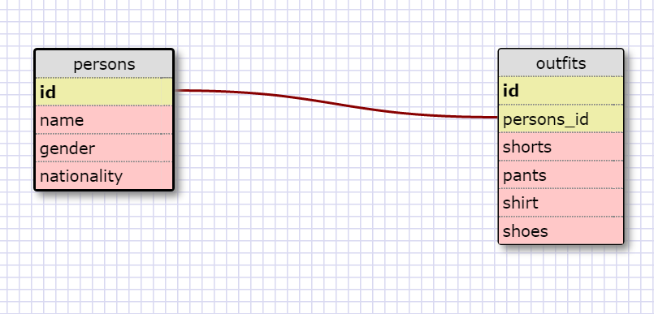

```
SELECT * FROM states;

SELECT * FROM regions;

SELECT state_name,population FROM states;

SELECT state_name,population
FROM states
ORDER BY population DESC;

SELECT state_name
FROM states
WHERE region_id=7;

SELECT state_name,population_density
FROM states
WHERE population_density>50
ORDER BY population_density ASC;

SELECT state_name
FROM states
WHERE population>1000000
AND population<1500000;

SELECT state_name,region_id
FROM states
ORDER BY region_id ASC;

SELECT region_name
FROM regions
WHERE region_name LIKE "%Central%";

SELECT region_name,state_name 
FROM regions,states
ORDER BY region_id ASC;
```



**What are databases for?**

Databases are for storing information. Typically, that takes the form of data that is 
stored in a table.

**What is a one-to-many relationship?**

A one-to-many relationship means that object1 belongs to object2 while 
object2 has_many object1.

**What is a primary key? What is a foreign key? How can you determine which is which?**

A primary key is an identifier for a particular row of information. A primary key does 
not have the same value as any other row of information. A foreign key is a unique key
that links to another table's primary key.

**How can you select information out of a SQL database? What are some general guidelines for that?**

SELECT columnName FROM tableName. The general guidelines is that these statements should 
end with a semi-colon and their keywords (ie. select, from, order by, etc.) should 
be capitalized.