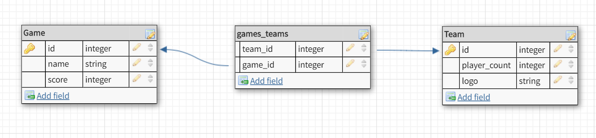
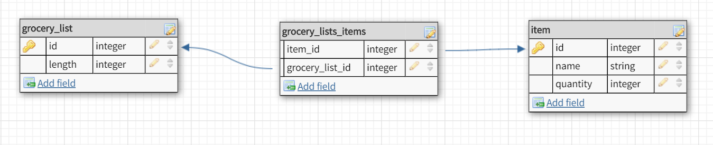

The heart table has one body, and a body has one heart. A body cannot have more 
than one heart (unless it's a special type of body), and a heart cannot have more 
than one body (unless it's a special type of heart).

The team table has many games and the game table has many teams (typically two that 
will play at a time).

**What is a one-to-one database?**

A one-to-one database is a relationship where table1 has a single table2, and table2 
has a single table1.

**When would you use a one-to-one database? (Think generally, not in terms of the example you created).**

One-to-one relationships occur when there is a general dependency between two tables. 
For instance, a passport has one person, and a person will only have one passport (generally).

**What is a many-to-many database?**

A many-to-many database is a relatioship where table1 has many table2s and table2 
also has many table1s.

**When would you use a many-to-many database? (Think generally, not in terms of the example you created).**

This relationship is used when a certain object has many of another object, and where 
that other object will have many of the object that has many of it. (Wow, that's confusing.)

**What is confusing about database schemas? What makes sense?**

When there are multiple databases and multiple relationships between them, it becomes 
difficult to understand the complexity of their relationships without looking at a 
3d schema instead of a 2d.