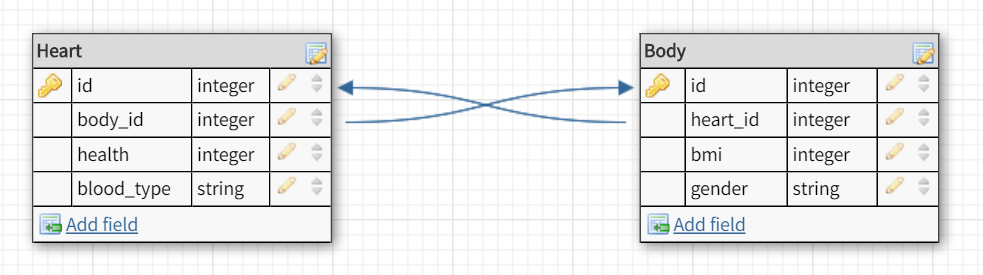

The heart table has one body, and a body has one heart. A body cannot have more 
than one heart (unless it's a special type of body), and a heart cannot have more 
than one body (unless it's a special type of heart).